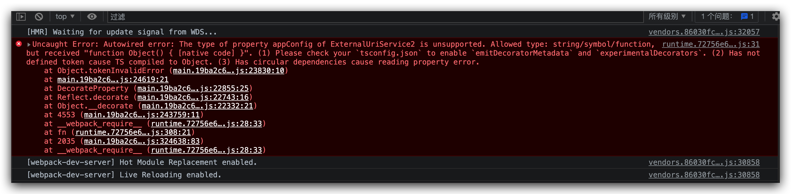

# 复现步骤

## 编译 OpenSumi-Vite

1. 进入 `opensumi-vite`
2. 运行 `yarn`，使用 yarn1
3. 运行 `yarn build:vite`

## 运行项目

1. 进入 `use-opensumi-vite`
2. 运行 `yarn`，使用 yarn1
3. 运行 `yarn dev`

将会看到启动报错，注意，项目确实是无法运行起来的状态，但是是因为缺少一些运行环境，比如 browser fs 等，但在次之前，可以看到 opensumi 已经是无法启动的状态。

